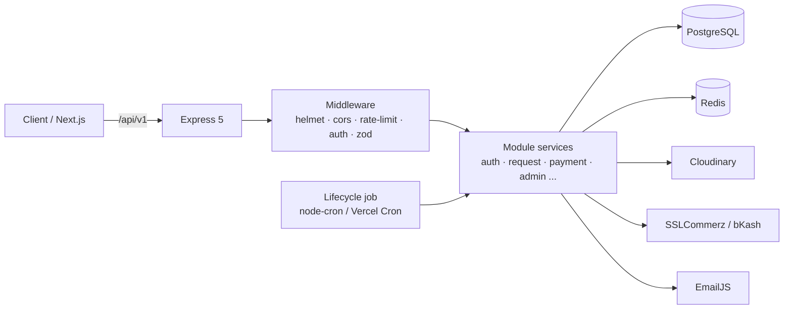
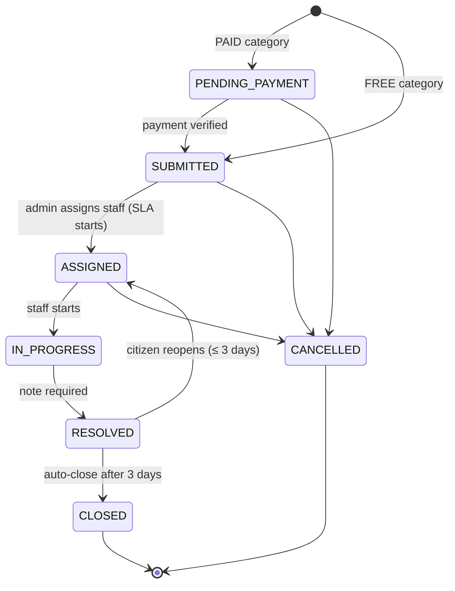
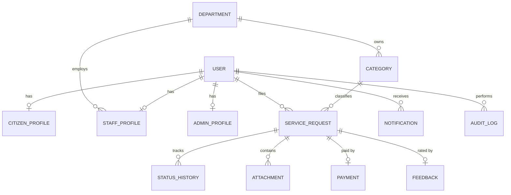

<div align="center">

# 🏙️ Nagar Sheba — Backend API

### City Complaint & Service Request Platform

A role-based REST API that lets citizens report civic issues and pay permit fees, routes each request to the right department, enforces SLA deadlines, and gives admins full oversight and an audit trail.

[](https://nodejs.org/)
[](https://expressjs.com/)
[](https://www.typescriptlang.org/)
[](https://www.prisma.io/)
[](https://www.postgresql.org/)
[](https://redis.io/)

[🌐 Live API](https://nagar-sheba.onrender.com) ·
[💻 Frontend Repo](https://github.com/parety308/Nagar-Sheba-Frontend) ·
[📦 Backend Repo](https://github.com/parety308/Nagar-Sheba)

</div>

---

## 📖 Contents

[Overview](#-overview) · [Features](#-features) · [Tech Stack](#️-tech-stack) · [Roles](#-roles--permissions) · [Architecture](#-architecture) · [Request Lifecycle](#-request-lifecycle) · [Database](#️-database) · [API Reference](#-api-reference) · [Payments](#-payments) · [Background Jobs](#️-background-jobs) · [Getting Started](#-getting-started) · [Environment](#-environment-variables) · [Deployment](#️-deployment) · [Security](#-security)

---

## 🎯 Overview

Residents often report potholes, water leaks, or licence needs through scattered channels with no tracking and no accountability. **Nagar Sheba** ("City Service") gives every request an owner, a deadline, and a visible history.

| For | What the API provides |
|---|---|
| 👤 **Citizens** | File requests with photos, pay fees online, track status, reopen or rate results |
| 🛠️ **Staff** | A department-scoped queue; start and resolve assigned work with proof |
| 🛡️ **Admins** | Departments, categories, users, reassignment, overrides, refunds, analytics, audit logs |

---

## ✨ Features

- 🔐 **JWT auth** (access + rotating refresh, httpOnly cookies or Bearer), **Google Sign-In**, email **OTP** registration and password reset
- 🧱 **3 fixed roles** with a DB re-check on every request (blocked or deleted accounts are rejected even with a valid token)
- 🔄 **Full request lifecycle** with status history, SLA clock, overdue flagging, reopen window and auto-close
- 💳 **SSLCommerz + bKash** with server-side verification, idempotent completion, automatic refunds on cancel and manual retry
- 🧾 **PDF receipts** (PDFKit), streamed on demand and emailed after payment
- 🖼️ **Cloudinary** uploads (≤ 5 images × 5 MB per request)
- 🔔 In-app **notifications** and 📧 transactional email via **EmailJS** + EJS templates
- 📊 Admin **dashboard stats**, staff **performance** metrics, **audit log** of every privileged action
- 🛡️ Helmet, CORS, Redis-backed **rate limiting** (global, login, OTP, contact), Zod validation, centralized error handler

---

## 🛠️ Tech Stack

| Layer | Technology |
|---|---|
| Runtime / Framework | Node.js 20+, Express 5, TypeScript (ESM, run with `tsx`) |
| Database / ORM | PostgreSQL, Prisma 7 (`@prisma/adapter-pg`, multi-file schema) |
| Cache / Rate limits | Redis (OTP storage, bKash token cache, `rate-limit-redis`) |
| Validation | Zod 4 |
| Auth | `jsonwebtoken`, `bcryptjs`, `google-auth-library` |
| Files | Multer (memory) → Cloudinary |
| Email | EmailJS REST API + EJS templates |
| PDF | PDFKit |
| Payments | SSLCommerz (`sslcommerz-lts`), bKash Tokenized Checkout |
| Jobs | `node-cron` (server) / Vercel Cron (serverless) |
| Quality | Biome (lint + format) |

---

## 👥 Roles & Permissions

| Role | Key permissions |
|---|---|
| **CITIZEN** | Create / cancel / reopen own requests, upload evidence, pay fees, leave feedback, download receipts, manage profile |
| **STAFF** | See requests in **own department**; move **assigned** requests `ASSIGNED → IN_PROGRESS → RESOLVED`; upload resolution proof; view own performance |
| **ADMIN** | Manage departments & categories, provision staff/admins, reassign, override status, block/unblock users, change roles, refund payments, view audit logs and stats |

---

## 🧭 Architecture



Each feature is a self-contained module: `route → validation → controller → service`.

```text
src/
├─ server.ts                 # long-running entry (DB + Redis + cron)
├─ app.ts                    # Express app, routes, error handling
├─ seedRun.ts                # one-off seeding script
└─ app/
   ├─ config/                # env loader
   ├─ errors/                # AppError
   ├─ jobs/                  # requestLifecycle.job.ts
   ├─ lib/                   # prisma, redis, bkash, sslcommerz, cloudinary, mailer, googleAuth, seed
   ├─ middleware/            # auth, validateRequest, upload, rateLimiter, errors
   ├─ module/                # admin · auth · category · department · feedback
   │                         # notification · payment · public · request
   ├─ templates/             # EJS email templates
   └─ utils/                 # jwt, catchAsync, sendResponse, receiptPdf, cloudinary upload
api/index.ts                 # Vercel serverless entry
prisma/schema/*.prisma       # multi-file schema
```

---

## 🔄 Request Lifecycle



| Rule | Detail |
|---|---|
| ⏱️ SLA | Starts on **Assigned**: `slaDueAt = now + category.slaHours` |
| 🚩 Overdue | Non-terminal requests past `slaDueAt` are flagged by the lifecycle job |
| 🔁 Reopen | Only `RESOLVED`, within 3 days, with a reason; SLA restarts |
| 🔒 Auto-close | `RESOLVED` → `CLOSED` after 3 days with no citizen action |
| 💸 Cancel | Allowed in `PENDING_PAYMENT`, `SUBMITTED`, `ASSIGNED`; paid requests trigger an automatic refund |
| 🛡️ Admin override | Cannot set `CANCELLED`/`PENDING_PAYMENT`; assigning needs the reassign flow; every override is audit-logged |

---

## 🗄️ Database



- One `User` table for all roles, linked 1:1 to exactly one profile.
- Soft deletes via nullable `deletedAt`; indexes on hot columns (`status`, `citizenId`, `departmentId`, `assignedStaffId`, `isOverdue`, `(userId, isRead)`).
- Enums: `Role`, `AccountStatus`, `AuthProvider`, `FeeType`, `RequestStatus`, `PaymentProvider`, `PaymentStatus`, `AttachmentType`, `NotificationChannel`.

---

## 📡 API Reference

Base path: **`/api/v1`**. Protected routes accept `Authorization: Bearer <accessToken>` or the `accessToken` httpOnly cookie. **58 endpoints** plus a health check and a cron hook.

<details open>
<summary><b>🔐 Auth</b> <code>/auth</code></summary>

| Method | Path | Access |
|---|---|---|
| POST | `/register` | Public — starts OTP registration |
| POST | `/verify-email` | Public — verifies OTP, creates account, sets cookies |
| POST | `/resend-otp` | Public (60 s cooldown) |
| POST | `/google-login` | Public — Google ID token |
| POST | `/login` | Public |
| POST | `/forgot-password` · `/reset-password` | Public (OTP) |
| POST | `/refresh-token` | Cookie or body |
| POST | `/logout` | Public |
| GET · PATCH | `/me` | Authenticated |
| PATCH | `/me/profile-image` | Authenticated (multipart `profileImage`) |
| POST | `/change-password` | Authenticated |
</details>

<details>
<summary><b>🏢 Departments & Categories</b> <code>/departments</code> · <code>/categories</code></summary>

| Method | Path | Access |
|---|---|---|
| GET | `/` · `/:id` | Public (optional auth; admins may `includeInactive=true`) |
| POST | `/` | Admin |
| PATCH | `/:id` | Admin |
| DELETE | `/:id` | Admin — soft delete (departments blocked while categories/staff/open requests exist) |

Category list supports `departmentId` filter. Paid categories require `feeAmount`; `slaHours` is 1–720.
</details>

<details>
<summary><b>📝 Service Requests</b> <code>/requests</code></summary>

| Method | Path | Access |
|---|---|---|
| POST | `/` | Citizen — multipart, up to 5 `attachments` |
| GET | `/` | Authenticated — scoped by role; filters: `status`, `categoryId`, `departmentId` (admin), `assigned=me\|unassigned`, `overdue`, `sortBy`, `sortOrder`, `page`, `limit` |
| GET | `/search?q=` | Authenticated — title / tracking ref |
| GET | `/performance/me` | Staff |
| GET | `/:id` | Authenticated — scoped |
| POST | `/:id/cancel` | Citizen (owner) |
| PATCH | `/:id/status` | Staff (assigned) / Admin (override) |
| PATCH | `/:id/reassign` | Admin |
| POST | `/:id/reopen` | Citizen (owner, ≤ 3 days) |
| POST | `/:id/attachments` | Authenticated — type enforced by role |
</details>

<details>
<summary><b>💳 Payments</b> <code>/payments</code></summary>

| Method | Path | Access |
|---|---|---|
| POST | `/initiate` | Citizen — `SSLCOMMERZ` or `BKASH` |
| GET | `/` · `/:id` | Authenticated (citizen: own, admin: all, staff: denied) |
| GET | `/:id/receipt` | Citizen / Admin — PDF |
| PATCH | `/:id/refund` | Admin — manual refund retry |
| POST | `/sslcommerz/ipn` | Public webhook |
| ALL | `/sslcommerz/success` · `/fail` · `/cancel` | Public redirects |
| GET | `/bkash/callback` | Public callback |
</details>

<details>
<summary><b>⭐ Feedback · 🔔 Notifications · 🛡️ Admin · 🌍 Public</b></summary>

| Method | Path | Access |
|---|---|---|
| POST | `/feedbacks` | Citizen — only on own `RESOLVED`/`CLOSED` request, once |
| GET | `/feedbacks` · `/feedbacks/:requestId` | Authenticated, scoped |
| GET | `/notifications/me` · `/unread-count` | Authenticated |
| PATCH | `/notifications/:id/read` · `/read-all` | Authenticated |
| POST | `/admin/staff` | Admin — provisions STAFF/ADMIN with emailed temp password |
| GET | `/admin/users` | Admin — filter by `role`, `status`, `search` |
| PATCH | `/admin/users/:id/status` · `/role` | Admin — block/unblock, STAFF ↔ ADMIN |
| GET | `/admin/audit-logs` · `/admin/dashboard-stats` | Admin |
| GET | `/public/stats` | Public |
| POST | `/public/contact` | Public (rate-limited) |
| GET | `/internal/lifecycle` | `Authorization: Bearer $CRON_SECRET` |
</details>

📎 A Postman collection is included in the repo root. Set `baseUrl` to the live API or `http://localhost:5000`.

**Response envelope**

```jsonc
// success
{ "success": true, "statusCode": 200, "message": "...", "data": {}, "meta": { "page": 1, "limit": 10, "total": 42, "totalPages": 5 } }

// error
{ "success": false, "statusCode": 400, "name": "AppError", "message": "Validation failed",
  "errors": [{ "path": "email", "message": "Please provide a valid email address." }] }
```

Stack traces and internal error details are exposed **only** in `development`.

---

## 💳 Payments

1. A request in a `PAID` category is created as `PENDING_PAYMENT` with `feeCharged`; a checkout session is opened automatically (SSLCommerz by default).
2. `POST /payments/initiate` creates or recreates a session and stores a `Payment` (`PENDING`) with a unique `providerRef`.
3. **SSLCommerz**: IPN and success redirect both call one idempotent verifier that re-validates `val_id`, amount and currency (BDT).
4. **bKash**: one callback; the server calls `executePayment` and checks `transactionStatus === "Completed"` and amount.
5. On success, `Payment → COMPLETED`, `Request → SUBMITTED` and a `StatusHistory` row are written **in one transaction**; the citizen gets a notification and an emailed PDF receipt.
6. A payment that completes after the request left `PENDING_PAYMENT` is auto-refunded.
7. Cancelling a paid request attempts an automatic refund without blocking the cancel; failures are audit-logged as `PAYMENT_REFUND_FAILED` and can be retried via `PATCH /payments/:id/refund`.

---

## ⏱️ Background Jobs

`runRequestLifecycleJob` does two things:

1. **Flag overdue** non-terminal requests past `slaDueAt`.
2. **Auto-close** `RESOLVED` requests older than 3 days (with a `StatusHistory` entry).

| Environment | Trigger |
|---|---|
| Long-running server (Render, VPS) | On startup + `node-cron` every **15 minutes** |
| Vercel (serverless) | Vercel Cron → `GET /api/v1/internal/lifecycle` (daily in `vercel.json`), secured by `CRON_SECRET` |

---

## 🚀 Getting Started

**Prerequisites:** Node.js 20+, PostgreSQL, Redis, Cloudinary, SSLCommerz / bKash sandbox credentials, a Google OAuth client ID, an EmailJS account.

```bash
git clone https://github.com/parety308/Nagar-Sheba.git
cd Nagar-Sheba
npm install                 # also runs `prisma generate`
cp .env.example .env        # fill in every value
npx prisma migrate deploy   # apply migrations
npm run seed                # departments, categories, admin, staff, demo citizen + sample data
npm run dev                 # http://localhost:5000
```

| Script | Description |
|---|---|
| `npm run dev` | `tsx watch` — local development |
| `npm start` | `tsx src/server.ts` — production |
| `npm run build` | `prisma generate` |
| `npm run seed` | `tsx src/seedRun.ts` (set `SEED_DEMO_DATA=false` to skip sample requests) |
| `npm run lint:check` · `format:check` · `lint:fix` | Biome |

> Add `"seed": "tsx src/seedRun.ts"` to `package.json` scripts if it is not there yet.

**Seeded data:** 4 departments (Roads, Waste, Water, Licensing), 7 categories (free complaints + paid permits), 1 admin, 4 staff (one per department), 1 demo citizen, and 15 sample requests across all statuses.

---

## 🔐 Environment Variables

Copy `.env.example` — **never commit real values.**

| Group | Variables |
|---|---|
| Runtime | `NODE_ENV`, `PORT`, `BACKEND_URL`, `FRONTEND_URL` (CORS origin + redirects) |
| Database | `DATABASE_URL` |
| Auth | `JWT_ACCESS_SECRET`, `JWT_REFRESH_SECRET`, `JWT_ACCESS_EXPIRES_IN`, `JWT_REFRESH_EXPIRES_IN`, `BCRYPT_SALT_ROUNDS`, `GOOGLE_CLIENT_ID` |
| Seed | `ADMIN_EMAIL`, `ADMIN_PASSWORD`, `STAFF_PASSWORD`, `DEMO_CITIZEN_EMAIL/PASSWORD`, `DEMO_ADMIN_EMAIL/PASSWORD`, `SEED_DEMO_DATA` |
| Redis | `REDIS_USERNAME`, `REDIS_PASSWORD`, `REDIS_HOST`, `REDIS_PORT` |
| Email | `EMAILJS_SERVICE_ID`, `EMAILJS_TEMPLATE_ID`, `EMAILJS_PUBLIC_KEY`, `EMAILJS_PRIVATE_KEY`, `CONTACT_RECEIVER_EMAIL` |
| Uploads | `CLOUDINARY_CLOUD_NAME`, `CLOUDINARY_API_KEY`, `CLOUDINARY_API_SECRET` |
| Payments | `SSLCOMMERZ_STORE_ID`, `SSLCOMMERZ_STORE_PASSWORD`, `SSLCOMMERZ_IS_LIVE`, `BKASH_BASE_URL`, `BKASH_USERNAME`, `BKASH_PASSWORD`, `BKASH_APP_KEY`, `BKASH_APP_SECRET` |
| Cron | `CRON_SECRET` |

> `BACKEND_URL` must be **publicly reachable** — SSLCommerz and bKash call it back.

---

## ☁️ Deployment

**Render / VPS (long-running):** build `npm install && npm run build`, start `npm start`. Set all env vars, `BACKEND_URL` to the service URL and `FRONTEND_URL` to the frontend origin. Run `npx prisma migrate deploy` on release.

**Vercel (serverless):** `vercel.json` rewrites all traffic to `api/index.ts`. Set `CRON_SECRET`; node-cron does not run there, so Vercel Cron calls the internal lifecycle route instead.

---

## 🔒 Security

- Passwords hashed with bcrypt; OTPs are 6 digits, stored in Redis for 5 minutes, with verify and resend limits.
- Access + refresh JWTs in `httpOnly` cookies (`secure` + `sameSite=none` in production).
- DB re-validation on every authenticated request; email/role changes invalidate sessions.
- Forgot-password responses are identical whether or not the account exists.
- Rate limits: global 1500/15 min, login 10/15 min, OTP 5/15 min, OTP verify 10/15 min, contact 5/15 min.
- Payment amounts and currency are verified server-side; callbacks are idempotent.
- Demo-account passwords cannot be changed through the API; protected admin accounts cannot be demoted.
- 🚨 If any secret is ever pasted into a chat, issue, or commit, **rotate it immediately**.

---

<div align="center">

Built as a **City Complaint & Service Platform** · Made with ❤️ for better cities

</div>
